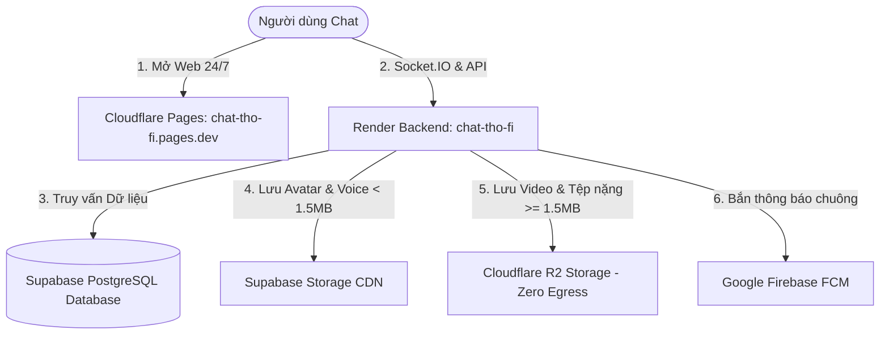

# 🏛️ KIẾN TRÚC HỆ THỐNG DỰ ÁN CHAT THO-FI (ARCHITECTURE & AI GUIDELINES)

> **Dành cho Lập trình viên và AI Assistants:** Hãy đọc kỹ tài liệu này trước khi thực hiện bất kỳ thay đổi nào trong dự án. Tài liệu mô tả chính xác 100% cấu trúc, luồng hoạt động và quy tắc bảo mật của dự án.

---

## 📌 1. QUY TẮC BẮT BUỘC (CRITICAL USER RULES)
1. **TUYỆT ĐỐI KHÔNG tự động thao tác trên máy tính** nếu người dùng chưa đồng ý hoặc yêu cầu.
2. **TUYỆT ĐỐI KHÔNG tự động push lên Git** trừ khi người dùng nói rõ: *"Hãy push code lên Git"*.
3. **Bảo toàn bảo mật**: Không bao giờ để lộ hoặc hardcode API Token bí mật, mã CVV thẻ ngân hàng vào code công khai.

---

## 🌐 2. KIẾN TRÚC ĐA TẦNG ĐÁM MÂY (MULTI-TIER CLOUD ARCHITECTURE)

Dự án sử dụng kiến trúc phân tán hiện đại, tách biệt hoàn toàn giữa Giao diện, Máy chủ và Lưu trữ để **tiết kiệm 100% chi phí và không bao giờ cạn kiệt băng thông**:



### Chi tiết các dịch vụ:
1. **Frontend (Giao diện Web)**:
   - **Nền tảng**: **Cloudflare Pages**
   - **Link Production**: `https://chat-tho-fi.pages.dev`
   - **Băng thông**: **Vô hạn (Unlimited Bandwidth - Miễn phí 100%)**.
   - **Mã nguồn**: `flutter_frontend/lib/`
   - **Gói xuất bản tĩnh**: `flutter_frontend/build/web/`
2. **Backend (Máy chủ Socket.IO & API)**:
   - **Nền tảng**: **Render.com** (Service: `chat-tho-fi`, deploy từ branch `main` repo `ThoGoodBoy06/chat-Tho---Fi`).
   - **Nhiệm vụ**: Duy trì WebSocket cho tin nhắn tức thì, cuộc gọi WebRTC, xác thực JWT.
   - **Tối ưu**: Render chỉ truyền text JSON cực nhẹ, tiêu tốn < 2% hạn mức 100GB/tháng.
3. **Cơ sở dữ liệu (Database)**:
   - **Nền tảng**: **Supabase PostgreSQL** kết nối qua Prisma ORM (hỗ trợ Connection Pooling pgbouncer).
4. **Lưu trữ tệp (Storage Dispatcher - Phân luồng thông minh)**:
   - **Avatar người dùng & Tin nhắn âm thanh (< 1.5MB)**: Lưu vào **Supabase Storage** (Buckets: `avatars`, `chat-media`).
   - **Video, Album ảnh lớn, Tệp nặng (>= 1.5MB)**: Lưu vào **Cloudflare R2** (Bucket: `tho-fi-media`, phát qua CDN `https://pub-451f105d0f0c42059b2b37383786f9b9.r2.dev` với **0đ phí tải về**).
5. **Thông báo đẩy (Push Notifications)**:
   - **Google Firebase Admin SDK (FCM)** gửi thông báo đến thiết bị khi app tắt/chạy nền.

---

## 📂 3. CẤU TRÚC THƯ MỤC CHÍNH

- `flutter_frontend/`:
  - `lib/screens/`: Các màn hình giao diện (chat_screen, login_screen, home_screen...).
  - `lib/services/`:
    - `api_service.dart`: Xử lý gọi HTTP REST API. Tự động nhận diện nếu chạy trên `pages.dev` / `workers.dev` sẽ trỏ về Render Backend.
    - `socket_service.dart`: Quản lý kết nối Socket.IO realtime.
  - `build/web/`: Bản build Flutter Web được dùng để tải lên Cloudflare Pages.
- `controllers/`: Logic điều khiển nghiệp vụ (chat, user, call, auth).
- `services/`:
  - `r2.service.js`: Xử lý tải tệp lên Cloudflare R2 (hỗ trợ Presigned URLs).
  - `storage.service.js`: Bộ điều phối phân luồng tệp thông minh giữa Supabase và R2.
  - `supabase.js`: Xử lý lưu trữ nhẹ trên Supabase Storage.
- `scripts/`:
  - `verify-full-system.js`: Kiểm thử toàn diện 100% hệ thống (Database, Supabase, R2, CDN, Server).
  - `patch-pages-bundle.js`: Vá bundle web để chạy mượt mà trên Cloudflare Pages / Workers.
- `server.js`: Điểm khởi chạy chính của máy chủ Express + Socket.IO.
- `.env`: Tệp cấu hình biến môi trường bí mật.

---

## 🛠️ 4. HƯỚNG DẪN DÀNH CHO AI KHI THỰC HIỆN CÔNG VIỆC

### Khi sửa Giao diện (Frontend):
1. Chỉnh sửa file trong `flutter_frontend/lib/`.
2. Chạy `node scripts/patch-pages-bundle.js` và `node scripts/add-workers-domain.js` để đảm bảo file `main.dart.js` trỏ đúng về backend Render khi deploy.
3. Đồng bộ thư mục `build/web` giữa root và `backend/flutter_frontend/build/web`.
4. Khi người dùng yêu cầu deploy, hướng dẫn người dùng kéo thả thư mục `flutter_frontend/build/web` vào **Cloudflare Pages** (`chat-tho-fi.pages.dev`).

### Khi sửa Máy chủ / API (Backend):
1. Chỉnh sửa code trong `controllers/`, `services/`, hoặc `server.js`.
2. Chạy kiểm thử tự động:
   ```bash
   node scripts/verify-full-system.js
   ```
3. Đảm bảo toàn bộ 6/6 hạng mục đều hiển thị `[PASS]`.
4. Khi người dùng yêu cầu: *"Hãy push code lên Git"*, thực hiện:
   ```bash
   git add .
   git commit -m "Mô tả tính năng"
   git push origin main
   ```
   *(Render sẽ tự động bắt lấy commit này và deploy trong 1-2 phút).*
